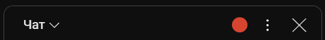

# Info
### Описание
Этот небольшой проект реализует локальный HTTP сервер по адресу http://localhost:3000 для просмотра списка отфильтрованного контента из сообщений чата трансляции YouTube в отдельной странице в браузере.

Это веб-приложение работает в связке с пользовательским скриптом, который встраивается в чат YouTube (на базе расширения Tampermokey), отслеживает сообщения и отправляет найденный отфильтрованный контент на ваш локальный сервер.

### Преимущества в сравнении с [бессерверной версией](https://github.com/Asethone/Userscripts/tree/main/YouTube_live_chat_filter)
 - У страницы теперь есть локальный адрес, что позволяет захватывать ее и выводить на трансляцию.
 - Перезагрузка страницы YouTube с трансляцией не стирает список авторов и предыдущие сообщения, так как эта информация хранится на локальном сервере.
 - Появилась возможность удалять сообщения без внесения автора этого сообщения в список при сохранении (через клавиши `D`, `Delete`, `Backspace` на выделенном сообщении).
 - Можно открыть любое количество страниц с отфильтрованными сообщениями – все они будут работать, а изменения, внесенные на одной странице, сразу же отобразятся на остальных.

### Кастомизация
Можно написать свой фильтр на JS, заменив код в файле [filter.user.js](https://github.com/Asethone/YTLiveChatView/blob/main/scripts/filter.user.js). Приведенный фильтр вычленяет из сообщений ID, состоящие из 6-9 цифр, обрабатывая разделители `,`.

# Download
 - Загрузить последнюю версию приложения сервера можно [здесь](https://github.com/Asethone/YTLiveChatView/releases/latest). Поддерживается только платформа Windows 64 bit.
 - Для работы скрипта-трекера сначала необходимо установить расширение [Tampermonkey](https://www.tampermonkey.net/) для вашего браузера. После установки и активации расширения нажмите [здесь](https://github.com/Asethone/YTLiveChatView/raw/main/scripts/filter.user.js) для установки скрипта-трекера вместе с фильтром. Откроется встроенный установщик Tampermonkey с предложением установить пользовательский скрипт.

# User manual
Для начала, нужно скачать и распаковать приложение с сервером, а также установить скрипт, как описано [выше](#download).

## Запуск

1. Запускаем файл `server.exe` для запуска сервера.

   - **ПРИМЕЧАНИЕ:** При первом запуске возможно предупреждение от системы Windows SmartScreen – игнорируйте его, нажав `Подробнее` и затем `Выполнить в любом случае`. Данное предупреждение связано с тем, что исполняемый файл не подписан. Приложение не крадет ваши данные и не внедряет вам вирус в систему – в этом можно удостовериться лично: весь код, включая код сборки, полностью открыт.
   - Также понадобится предоставить приложению доступ к локальным сетям. Это нужно для корректного функционирования локального сервера по определению.

    После запуска откроется окно терминала с уведомлением о том, что сервер запущен, и локальным адресом страницы. `Ctrl`+клик по адресу откроет страницу в браузере. Либо, если это не сработало, просто скопируйте адрес и вставьте в новом окне браузера. На этой странице будут отображаться все отфильтрованные сообщения.

   - **ПРИМЕЧАНИЕ:** По мере работы сервера, в окошке терминала будет появляться служебная информация. Его можно просто свернуть и не обращать на него внимания. При возникновении ошибок эта информация в последствии поможет устранить проблему.

2. На странице трансляции YouTube сверху чата появится серый кружок – индикация того, что трекер неактивен.

    

    При нажатии на него, он сменит цвет на красный, что означает, что скрпит трекера работает: он будет слушать сообщения из чата, фильтровать их и перенаправлять на сервер.
    - **ВАЖНО:** Не забудьте поменять в фильтр `Интересные сообщения` на `Чат`, чтобы трекер учитывал все сообщения из чата.

    

    - **ВАЖНО:** Трекер отлавливает только те сообщения, которые отображаются в самом низу чата. По умолчанию чат YouTube автоматически показывает самые новые сообщения, но если вы в ходе трансляции пролистываете чат вверх, то трекер новые сообщения увидит только после того, как вы снова пролистаете чат до низу. Имейте это в виду.

## Страница просмотра сообщений
Теперь на открытой на шаге 1 странице начнут отображаться отфильтрованные сообщения.

Кнопка с галочкой справа от сообщения удалит сообщение из списка и внесет автора в список сохраненных авторов. Текстовый файл со списком сохраненных авторов вы можете скачать, нажав на кнопку `Save authors` внизу страницы. Это может быть полезно после трансляции.

При нажатии на имя автора или на текст сообщения они автоматически скопируются в буфер обмена. Последнее сообщение, на котором вы скопировали текст, будет выделено. Снять выделение можно клавишей `Esc`.

При нажатии на клавиши `D`, `Delete`, `Backspace` выделенное сообщение так же удалится, но *без сохранения автора* в список.

Все изменения на странице просмотра сообщений никак не влияют на реальный чат трансляции в YouTube.

## Закрытие приложения
Для завершения работы приложения сервера достаточно просто закрыть окно терминала.
